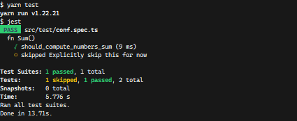

<h1 align="center"> Testy 🧨 </h1>

<p align="center">
  Decorator-based testing frameworks
</p>

<p align="center">
  <a href="https://www.npmjs.com/@yumii.saiko/testy">
    
  </a>&nbsp;
</p>

<h2>What 👽 ? </h2>

<h3>It is</h3>

- for learning purpose ... (TS v5 decorator proposal)
- a facade for the existent ones
- ... a candy for the Java JUnit folks
- ... what it is, ... a framework ?

<h3>It isn't</h3>

- Re-implemented Testing framework
- Ready for real life project (yet)

<h2>Features ✨</h2>

- [ ] Use the same Testing Api for every testing framework
- [x] Isolated test
- [ ] Decorators
  - [x] Test Class: @TestClass(desc?)
  - [x] Hooks: @BeforeAll, @BeforeEach, @AfterEach, @AfterAll
  - [ ] Test Suites: @Test(desc?, skip?, order?)
    - [x] Base decorator
    - [x] skip
    - [ ] Order (not really useful)
- [ ] Compatibility
  - [x] Custom platform
  - [x] jest
  - [ ] vitest
  - [ ] Mocha
  - [ ] playwright
  - [ ] cypress
  - [ ] Jasmine

<h2>Usage</h2>

Suppose you have a _function sum(...numbers)_ function in a file named `sum.ts`.
You would like it to contain both the `sum` function and its `test`. Here's how you could accomplish that.

> src/sum.ts

```typescript
import {TestClass, Test} from "@yumii.saiko/testy";

export function sum(...numbers: number[]) {
  return numbers.reduce((acc, n) => acc + n, 0);
}

@TestClass({
  desc: "fn Sum()",
})
export class SumTest {
  @Test()
  should_compute_numbers_sum() {
    expect(sum(10, 10)).toEqual(20);
  }

  @Test({
    skip: true,
    desc: "Explicitly skip this for now",
  })
  not_implemented_yet() {}
}
```

Using the filename pattern that your testing framework might identify, example `src/test/*/**/*.spec.ts`, create a single file in which all of the `Test class` registrations should go.

> src/test/bootstrap_test.spec.ts

```typescript
import {defineTests} from "@yumii.saiko/testy";
// There we provided our own impl for jest platform
// Testy will come with a set of platform so you don't need to impl them yourself
import {PlatformJestImpl} from "../lib/testy_platform_jest"; 
import {SumTest} from "../sum";

defineTests([SumTest], PlatformJestImpl);
```

<p>
  You can find the code for this example in the <a href="https://github.com/YumeT023/testy/tree/main/example" alt="example code">example folder</a>
</p>

> screenshot (jest)


